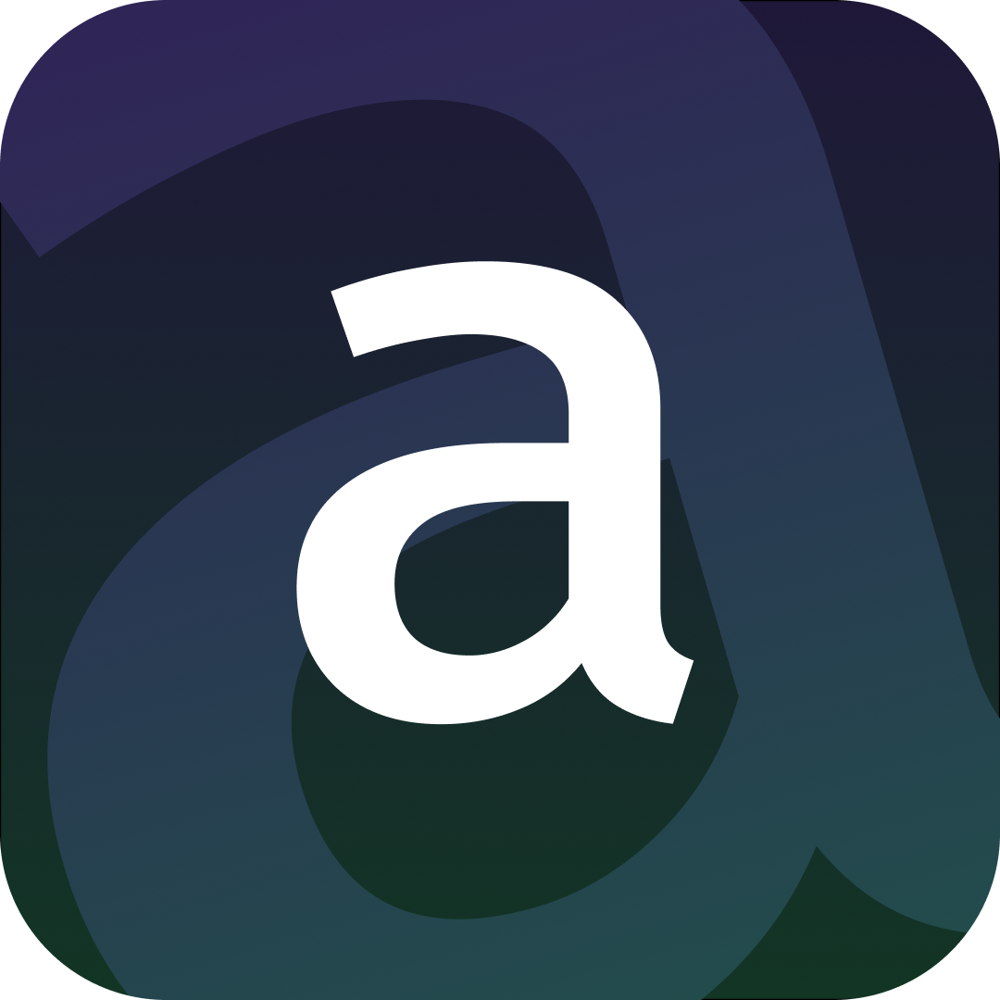

## AmbientGPT



**Run GPT-4 and local foundation models with full ambient knowledge of your screen.** Foundation models have long been confined to the browser. With AmbientGPT, your screen context is directly inferred as part of the query, ensuring you never need to explicitly upload context again!

<video src="updated_ambient.mov" controls>
  Your browser does not support the video tag.
</video>


**Note:** To run local models, you will need an ARM64 (M1, M2, M3, ...) MacBook. Additionally, a compatible OpenAI API key is required to use GPT-4o.

### Usage


Install the necessary packages:
```bash
pip3 install -r requirements.txt
yarn && yarn dev
```

**MacOS app coming soon** (pending Apple certification)
